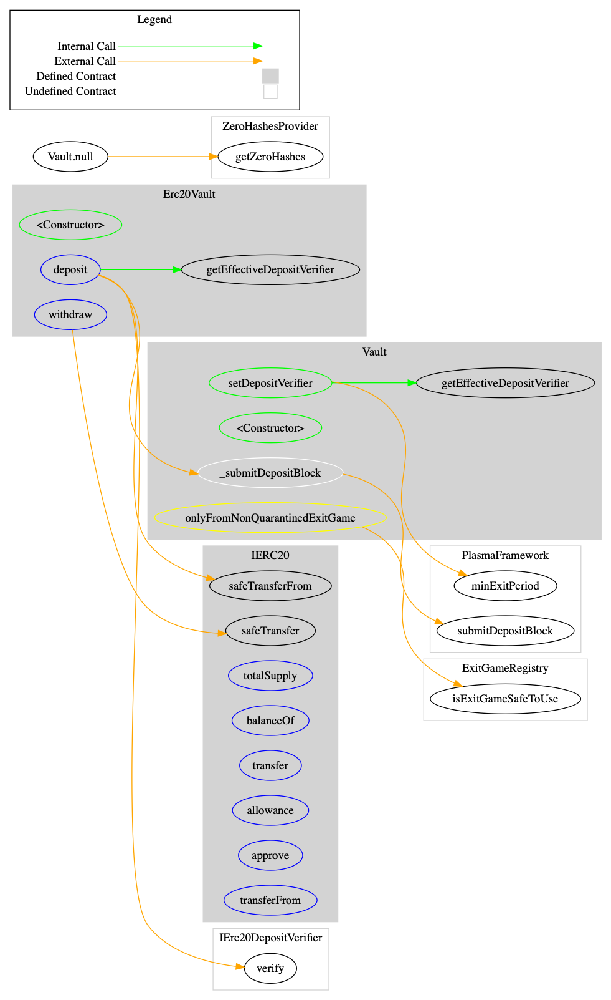
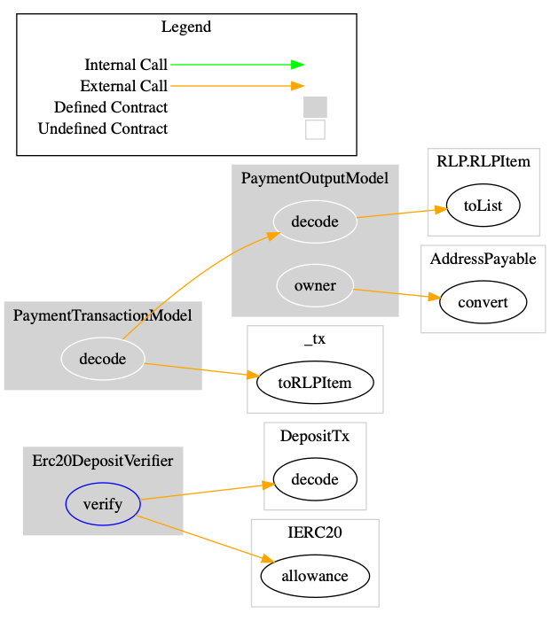
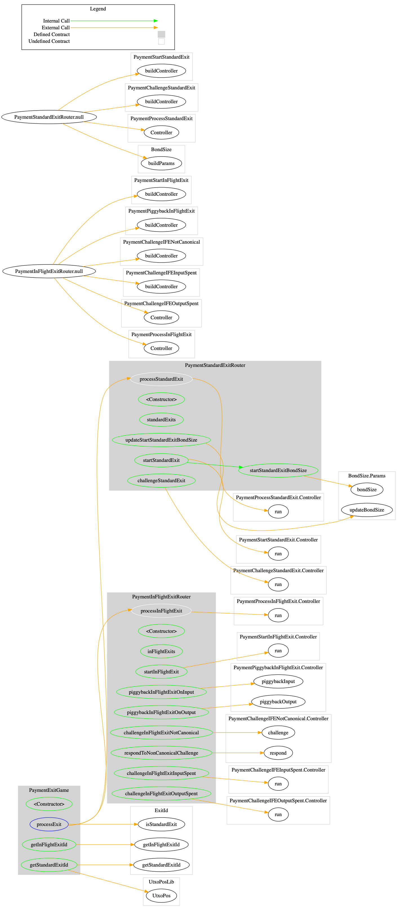
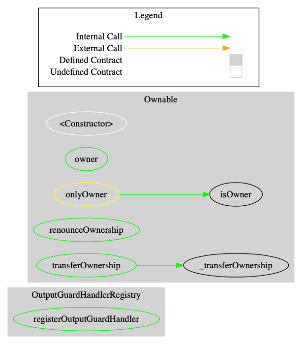

# Summary 

The goal of this document is ... 

# Architecture and Design

## Roles 

The following roles exist in the root chain contracts as well as in the OMG network components, the child chain and the watcher.

- Operator: Runs the child chain and is authorised to create child chain blocks and submit them (root hash) to the root chain.
- Watcher: Runs an observing node that connects to the root chain and the child chain server's API. User ensures that the child chain is valid and notifies otherwise.
- Plasma User: EOA that has assets on the root chain and who uses them on the OMG network.
- Authority: EOA used exclusively to submit plasma block hashes to the root chain. The child chain assumes at deployment that the authority account has nonce zero and no transactions have been sent from it.
- Deployer: EOA used to deploy all root chain contracts. 
- Maintainer: MultiSig wallet that is allowed to initiate upgrades of specific root chain contracts.
- Contract: An root chain contract that is authorised to call specific functions in other root chain contrats.

### Todo 

- [ ] Decide on maintainer setup. I suggest that we deploy a Gnosis MultiSig wallet with multiple signers. The maintainer can then be linked statically during deployment.


# Root chain deployed contracts

The term component is used in this document to refer to contracts that are deployed to a root chain backend. 

## EthVault 

Check the UXTO Based Plasma Abstract Layer Design document for detailed information of Vault desgin consideration (see [1](https://docs.google.com/document/d/1PSxLnMskjqje4MksmW2msSSg-GtZoBSMNYey9nEDvt8/edit#heading=h.ksu0dgzqozk)).


### Contract diagram  


### Access Matrix 

| Function  | Role | 
|---|---|
|  EthVault.constuctor, Vault.constructor, Operated.constructor | Deployer |
|  deposit | Plasma User  | 
|  withdraw |  Plasma User |
|  setDepositVerifier | Maintainer  |

### Storgage 

```Solidity 
    PlasmaFramework internal framework
    bytes32[16] internal EthDepositVerifier
    address[2] public depositVerifiers
    uint256 public newDepositVerifierMaturityTimestamp
    address private _operator
```

- `framework`: Links to the PlasmaFramework controller. The address is set during deployment through the constructor
- `zeroHashes`: Todo 
- `depositVerifiers`: Sets the deposit verifier contract. If one contract is already set then the new one will be effective after MIN_EXIT_PERIOD
- `newDepositVerifierMaturityTimestamp`: Set initially to `2 ** 255` and then to `now + MIN_EXIT_PERIOD` when a new EthDepositVerifier gets added. 
- `_operator`: Maintainer address is able to upgrade the EthDepositVerifier that is called during depositing ETH

### Todo 

- [ ] Rename operator to maintainer. Set the address during deployment.
- [ ] Check MIN_EXIT_PERIOD is enough for users to actually withdraw their funds  

## EthDepositVerifier 

### Contract diagram  


### Access Matrix 

| Function  | Role | 
|---|---|
|  verify | Intended to be used by EthVault. Can be called by anyone though | 

### Storgage 

```Solidity 
     uint8 constant internal DEPOSIT_TX_TYPE
```

- `DEPOSIT_TX_TYPE`:

## Erc20Vault

### Contract diagram  



### Access Matrix 

### Storgage 

## Erc20DepositVerifier

### Contract diagram  



### Access Matrix 

### Storgage 

## PlasmaFramework

### Contract diagram  


### Access Matrix 

| Function  | Role | 
|---|---|
|  initAuthority | Intended to be used by EthVault. Can be called by anyone though | 
| setAuthority | | 
| submitBlock | Authority | 
| submitDepositBlock | Contact(can only be called by non quaranained Vaults) | 


### Todo 

- [ ] Shouldn't submitDepositBlock be external as it should only be callable from a Vault?
- [ ] Create a modifier for submitBlock() ... onlyAuthority
- [ ] Why do we need an upgradeable Autority address?
- [ ] The current design with calling init() after contract creation is susceptible to front running 

### Storgage 

```Solidity 
    uint256 public constant CHILD_BLOCK_INTERVAL
    uint256 public minExitPeriod 

    address private _operator

    mapping(uint256 => address) private _vaults
    mapping(address => uint256) private _vaultToId
    Quarantine.Data private _quarantine

    mapping(uint256 => address) private _exitGames
    mapping(address => uint256) private _exitGameToTxType
    mapping(uint256 => uint8) private _protocols
    Quarantine.Data private _quarantine

    uint64 public exitQueueNonce 
    mapping (uint256 => Exit) public exits
    mapping (address => PriorityQueue) public exitsQueues
    mapping (bytes32 => bool) public isOutputSpent

    address public authority;
    uint256 public childBlockInterval;
    uint256 public nextChildBlock;
    uint256 public nextDepositBlock;

    mapping (uint256 => BlockModel.Block) public blocks;

```

## PaymentExitGame

### Contract diagram  



### Access Matrix 


| Function  | Role | 
|---|---|
| processExit | Contract:PlasmaFramework |
| updateStartStandardExitBondSize  | Maintainer | 
| startStandardExit | Plasma User |
| challengeStandardExit | Plasma User |
| startInFlightExit | Plasma User |
| piggybackInFlightExitOnInput | Plasma User |
| piggybackInFlightExitOnOutput | Plasma User |
| challengeInFlightExitNotCanonical | Plasma User |
| respondToNonCanonicalChallenge | Plasma User |
| challengeInFlightExitInputSpent | Plasma User |
| challengeInFlightExitOutputSpent | Plasma User |


### Storgage 

```Solidity 
    PlasmaFramework private plasmaFramework
    PaymentExitDataModel.StandardExitMap internal standardExitMap
    PaymentStartStandardExit.Controller internal startStandardExitController
    PaymentProcessStandardExit.Controller internal processStandardExitController
    PaymentChallengeStandardExit.Controller internal challengeStandardExitController
    BondSize.Params internal startStandardExitBond

    uint256 public constant IN_FLIGHT_EXIT_BOND = 31415926535 wei;
    uint256 public constant PIGGYBACK_BOND = 31415926535 wei;

    PaymentExitDataModel.InFlightExitMap internal inFlightExitMap;
    PaymentStartInFlightExit.Controller internal startInFlightExitController;
    PaymentPiggybackInFlightExit.Controller internal piggybackInFlightExitController;
    PaymentChallengeIFENotCanonical.Controller internal challengeCanonicityController;
    PaymentProcessInFlightExit.Controller internal processInflightExitController;
    PaymentChallengeIFEOutputSpent.Controller internal challengeOutputSpentController;
```


## SpendingConditionRegistry

### Contract diagram  


### Access Matrix 

### Storgage 

```
    mapping(bytes32 => ISpendingCondition) internal _spendingConditions;
    address public owner
```


## OutputGuardHandlerRegistry

### Contract diagram  



### Access Matrix 


### Storgage 

```
    mapping(uint256 => IOutputGuardHandler) public outputGuardHandlers
    address public owner
```